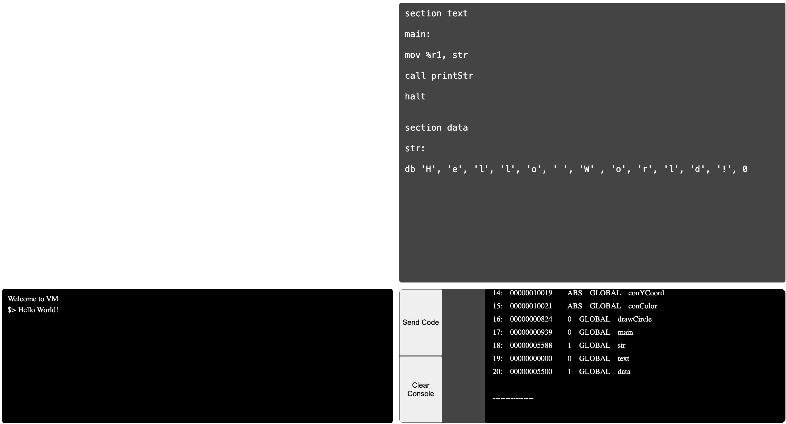

## VM

Virtual machine with custom assembler and object file format.

As addition there is a linker and a sort of objdump for my binary format.

Instructions set can be found [here](./vm/instructions/tmpl/instructionsMeta.inc) 

VM can be ran via web interface with Golang(>=1.19) server as a backend:

1. Top-left - screen
2. Top-right - code input area
3. Bottom-right - logs
4. Bottom-left - console

User's programm first assemebled and then linked against [standard library](./server/stdlib)

On success, in log field will appear result of objdump for linked executable.

[Another example](./pictures/circle.png) with `drawСircle` library function.

Console interaction techniques can be seen [here](./server/stdlib/printStr.code) and [screen](./server/stdlib/drawCircle.code)

### How to run tests

Golang >=1.19 must be installed.

` cmake -B ./build -DCMAKE_BUILD_TYPE=Debug `

` cmake --build ./build --config Debug --target install `

` cmake --build ./build --config Debug --target BuildServerStdLib `

` ctest --test-dir ./build -C Debug --output-on-failure`

### How to run server locally

After configure and build steps:

` cd server && go run . --addr :8080`

Then open localhost:8080 in browser.

